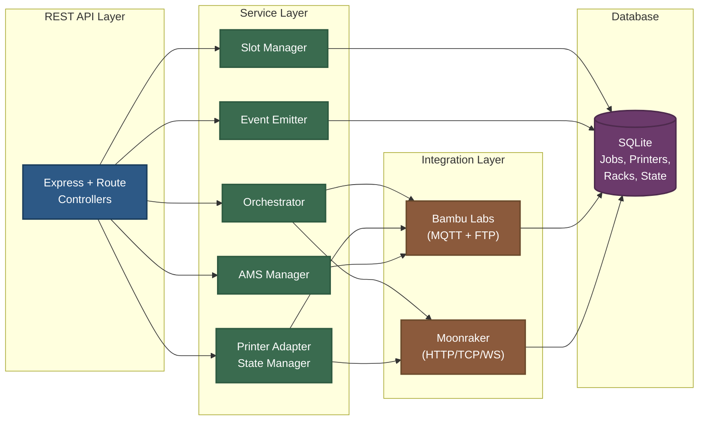

# OTTOMAT3D Backend

A Node.js backend system for autonomous 3D printing operations, enabling 24/7 unattended manufacturing through coordinated printer control, intelligent storage management, and automated workflow orchestration.

## Overview

OTTOMAT3D addresses the operational challenges of continuous 3D printing by automating the complete print-to-storage workflow. The system manages multiple printers across different manufacturers, ejection devices, and storage racks, coordinating hardware through a comprehensive REST API and real-time monitoring system.

### Key Capabilities

- **Autonomous Operation**: Complete print job lifecycle from file upload to finished part storage without human intervention
- **Multi-Brand Integration**: Extensible adapter pattern supporting 7+ printer manufacturers (Bambu Labs, Klipper/Moonraker, Anycubic, Creality, Elegoo, Flashforge, Prusa) through standardized interfaces
- **AMS Support**: Automatic Material System integration for multi-filament printing with real-time spool tracking and filament management
- **Intelligent Storage**: Height-aware slot assignment algorithm optimizing storage density while preserving space for tall prints
- **Real-Time Orchestration**: Sub-second conflict detection and automatic job reassignment during manual interventions
- **Concurrent Processing**: Simultaneous management of multiple printers with independent progress tracking
- **Cross-Platform Desktop App**: Electron-based application with automated build pipeline and code signing

## Packaged Application


## System Architecture


## API Design

The backend exposes a RESTful API organized into logical resource groups:

### Core Endpoints

**Printers** (`/api/printers`)
- CRUD operations for printer management across multiple brands
- Live status monitoring with brand-specific adapter integration
- Command execution (start, pause, resume, stop)
- File upload and G-code sending
- AMS filament spool management and tracking

**Print Jobs** (`/api/print-jobs`)
- Two-step workflow: file upload/parse, then job creation
- Lifecycle management (queued, printing, completed)
- Progress tracking and status updates
- Multi-filament job support with AMS coordination

**OttoEject Devices** (`/api/ottoeject`)
- Device registration and management
- Macro execution for automation sequences
- Live status monitoring

**Storage Racks** (`/api/ottoracks`)
- Rack creation with configurable shelves
- Shelf state management
- Event emission for conflict detection

**Orchestration** (`/api/orchestration`)
- Real-time system status
- Active job monitoring
- Health checks and service management

Complete API documentation available in `backend/OttoEngine API Documentation.md`.

## Technology Stack

**Backend Runtime**
- Node.js 18+ with Express framework
- SQLite for embedded database
- Native MQTT client for printer communication

**Printer Integration**
- Custom Bambu Labs MQTT + FTP package with AMS support
- Klipper/Moonraker HTTP API client
- Anycubic MQTT integration with AMS compatibility
- Creality MQTT adapter
- Elegoo network protocol integration
- Flashforge TCP/IP communication
- Prusa Connect API client
- Adapter pattern for unified multi-brand support

**Desktop Application**
- Electron for cross-platform native app
- React frontend integration
- Automated build pipeline with Electron Forge
- macOS code signing with Developer ID

**Development Tools**
- Postman for API testing
- GitLab for version control and collaboration
- VS Code for development
- Electron Forge for app packaging and distribution

## Repository Structure

This repository contains:

**`backend/`** - Main Node.js backend (primary focus)
- Complete Express application with service layer
- Custom Bambu Labs integration package
- Multi-brand printer adapters
- REST API implementation
- Orchestration and automation services
- AMS management system

**`frontend/`** - React frontend
- Web interface for system monitoring and control
- Real-time printer status dashboard
- Job management interface
- AMS filament tracking UI

**`electron/`** - Desktop application
- Main process and preload scripts
- Cross-platform packaging configuration
- Code signing automation

**`scripts/`** - Build and deployment automation
- macOS code signing script with entitlements
- Build helpers and utilities

**`__python_scripts/`** - Historical Python implementations (gitignored)
- `dual_printer_orchestrator.py` - Intermediate orchestration solution
- Demonstrates evolution from scripts to integrated backend
- Reference implementation for workflow validation

## Getting Started

### Prerequisites

- Node.js 18+ and npm
- 3D printer with network connectivity (supports Bambu Labs, Klipper, Anycubic, Creality, Elegoo, Flashforge, or Prusa)
- OttoEject device (optional, for automated ejection)

### Installation

```bash
cd backend
npm install
```

### Configuration

1. Copy `.env.example` to `.env` (if available) or create `.env` with:
   ```
   NODE_ENV=development
   SQLITE_DB_PATH=./db/ottomat3d.db
   PORT=3000
   ```

2. Update printer configuration with your device details (see API documentation for registration endpoints)

### Running the Backend

```bash
npm start
```

The API will be available at `http://localhost:3000/api`

### Running the Desktop App

```bash
npm run start
```

### Building the Desktop App

```bash
# Build frontend first
npm run build:frontend

# Package for current platform
npm run package

# Sign the macOS app (requires Developer ID certificate)
npm run sign

# Complete build with signing
npm run package:signed
```

### Testing

Import the Postman collection from `backend/_testing/postman/` for comprehensive API testing.

## Development Process

This project was developed in a collaborative environment using GitLab for version control and workflow management. The experience provided hands-on practice with professional development practices:

### GitLab Workflow

- **Branch Strategy**: Feature branches for all development work, with `develop` as integration test branch
- **Merge Requests**: All code changes went through MR process with detailed descriptions and technical context
- **Code Reviews**: Regular review cycles with team members, focusing on architecture decisions and implementation quality
- **Conflict Resolution**: Managed merge conflicts across multiple concurrent feature branches
- **Branch Management**: Created focused feature branches for specific capabilities (adapter integration, slot management, orchestration engine, event system, API integration, AMS support)

### Engineering Practices

- **Incremental Development**: Built system in logical phases, validating each layer before proceeding
- **Documentation**: Maintained comprehensive technical documentation throughout development
- **Testing**: Created Postman collection for API validation and simulator script for algorithm testing
- **Refactoring**: Iteratively improved architecture based on code review feedback
- **CI/CD**: Implemented automated build and code signing pipeline for desktop application

The GitLab experience reinforced the importance of clear communication in MRs, proper branch hygiene, and the value of collaborative code review in catching architectural issues early.

## Database Architecture

The system uses SQLite with a normalized relational schema designed for automated 3D printing workflows, supporting concurrent job processing and real-time state management.


**Core Schema:**

- **`printers`** - Multi-brand device registration with JSON-stored build volumes, filament configurations, and AMS metadata
- **`print_items`** - Parsed G-code metadata with height data for intelligent slot assignment
- **`print_jobs`** - Complete lifecycle tracking with orchestration fields (assigned slots, workflow status, timestamps)
- **`storage_racks` + `rack_slots`** - Storage management with three-state slot model (no plate, empty plate, plate with print)
- **`ottoejects`** - Automated ejection device management

**Key Design Features:**

- Foreign key relationships with CASCADE/RESTRICT rules for data integrity
- Automated `updated_at` triggers for state change tracking
- JSON columns for flexible metadata without schema changes (AMS configurations, printer-specific settings)
- Orchestration fields enabling conflict detection and automatic job reassignment
- Three-state slot model supporting dynamic clearance calculations

This schema evolved through three development phases, from simple tracking to supporting fully autonomous workflow execution with real-time conflict resolution and multi-brand printer support.

## Technical Challenges & Solutions

### Challenge 1: Multi-Brand Printer Integration

**Problem**: Each printer manufacturer uses different protocols (MQTT, HTTP, TCP) and data formats, making unified control difficult.

**Solution**: Implemented adapter pattern with standardized interface. Each brand gets its own adapter implementing common operations (connect, disconnect, send file, get status, execute commands).

**Implementation**:
- Created base adapter interface defining required methods
- Built brand-specific adapters for 7 manufacturers
- Developed adapter state manager for lifecycle coordination
- Implemented protocol-specific clients (MQTT for Bambu/Anycubic/Creality, HTTP for Prusa/Klipper, TCP for Flashforge)

**Results**: Can control any supported printer through identical API calls, simplifying orchestration logic and enabling easy addition of new brands.

### Challenge 2: AMS (Automatic Material System) Integration

**Problem**: Multi-filament printing requires real-time tracking of spool usage, filament changes, and AMS state across different printer brands with varying AMS implementations.

**Solution**: Built AMS management layer that abstracts brand differences while maintaining compatibility with Bambu Labs and Anycubic AMS units.

**Implementation**:
- Designed unified AMS state model tracking slots, spools, and filament properties
- Created real-time event system for AMS state changes
- Implemented spool lifecycle tracking (loaded, in-use, empty, removed)
- Built UI components for visual AMS monitoring

**Results**: Seamless multi-filament job execution with automatic filament selection and spool management across different AMS implementations.

### Challenge 3: Cross-Platform Desktop Application

**Problem**: Users needed a native desktop application that works on macOS, Windows, and Linux, with proper code signing for security.

**Solution**: Implemented Electron-based desktop app with automated build pipeline and platform-specific code signing.

**Implementation**:
- Configured Electron Forge for multi-platform packaging
- Built automated macOS code signing script handling dylibs, frameworks, and app bundle
- Created entitlements file for macOS security requirements
- Integrated frontend build into packaging workflow

**Results**: Distributable desktop application with proper code signing, passing macOS Gatekeeper verification.

### Challenge 4: Platform Selection

**Problem**: Initial Python + Flask approach lacked the multithreading capabilities required for managing multiple concurrent printer connections and real-time monitoring.

**Solution**: Migrated to Node.js + Express, leveraging JavaScript's event loop and non-blocking I/O. This required building custom integration packages since existing Python packages weren't compatible with Node.js.

**Implementation**: Developed complete MQTT + FTP clients for supported printers by studying existing implementations and reverse-engineering protocol communication patterns.

### Challenge 5: MQTT Connection Stability

**Problem**: Printer connections dropped during long print jobs (60+ minutes), causing loss of status updates and breaking the monitoring system.

**Solution**: Implemented robust reconnection logic with exponential backoff, connection health monitoring, and automatic recovery. Enhanced the MQTT client with connection state tracking and graceful reconnection that preserves ongoing operations.

**Results**: Achieved stable connections over 12+ hour print runs with automatic recovery from network interruptions.

### Challenge 6: Architectural Evolution

**Initial Approach**: Python scripts acting as orchestrators, using the backend APIs as proxies for device communication.

**Evolution**:
1. **Phase 1**: Standalone Python scripts with hardcoded workflows
2. **Phase 2**: Python orchestrator calling backend REST APIs (see `__python_scripts/dual_printer_orchestrator.py`)
3. **Phase 3**: Complete Node.js backend with integrated orchestration service
4. **Phase 4**: Multi-brand adapter system with AMS support
5. **Phase 5**: Electron desktop application with automated builds

**Python Orchestrator Learnings**:
- Implemented multithreading with `ThreadPoolExecutor` for concurrent printer monitoring
- Developed coordination primitives (ejection lock) for resource arbitration
- Validated workflow logic before porting to Node.js

### Challenge 7: Storage Optimization

**Problem**: Simple bottom-up storage wasted vertical space and blocked slots needed for taller prints.

**Solution**: Developed a height-aware slot assignment algorithm with multi-factor scoring:
- Height efficiency (40%): How well print height matches available clearance
- Slot position (30%): Bottom-up preference with height category consideration
- Clearance waste (20%): Penalty for inefficient space utilization
- Future flexibility (10%): Impact on queued jobs

**Validation**: Created a Node.js simulator to test the algorithm against various rack configurations and job mixes, achieving 30-40% better space utilization compared to naive approaches.

This incremental approach de-risked the migration and provided a working reference implementation during backend development.

## Technical Skills Demonstrated

- Backend API development with Node.js and Express
- Real-time system integration and event-driven architecture
- Custom protocol implementation (MQTT, FTP, HTTP, TCP/IP)
- Multi-brand hardware integration with adapter pattern
- Algorithm design and optimization
- Database schema design and transaction management
- Service-oriented architecture and design patterns
- Hardware integration and device control
- Cross-platform desktop application development with Electron
- Automated build pipelines and code signing
- Version control workflow and collaboration
- Code review and technical documentation

## Future Work

- Additional printer brand adapters (Ultimaker, FlashForge Adventurer)
- Enhanced web frontend with real-time WebSocket updates
- Advanced scheduling and queue management
- Predictive maintenance tracking
- Cloud deployment with containerization
- Mobile application for remote monitoring

## License

MIT License - See LICENSE file for details

---

**Note**: This repository is a portfolio showcase. Sensitive information (IP addresses, access codes, serial numbers) has been sanitized for public sharing.
