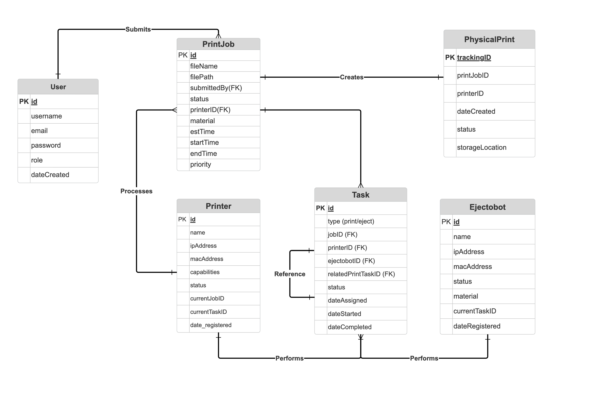

# OTTOMAT3D Backend

Node.js/Express.js backend for OTTOMAT3D, serving as an API proxy for controlling 3D printers and OTTOeject devices via a Python script.

## 1. Backend Server

### Setup

1.  **Prerequisites:** Node.js (v16+), npm.
2.  **Navigate to `backend` directory.**
3.  **Install Dependencies:**
    ```bash
    npm install
    ```
4.  **Database (SQLite):**
    *   The `.env` file configures `SQLITE_DB_PATH=db/ottomat3d.db`.
    *   **To initialize/reset DB:** Stop server, delete `db/ottomat3d.db`, then run:
        ```bash
        sqlite3 db/ottomat3d.db < db/schema.sql
        ```
        *(Ensure `sqlite3` CLI tool is installed.)*

### Running

*   **Development (with auto-restart):**
    ```bash
    npm run start:dev
    ```
*   **Standard Start:**
    ```bash
    npm start
    ```
    Server defaults to `http://localhost:3000`. API is at `/api`.

---

## 2. Database Architecture

The backend uses SQLite with a normalized relational schema designed to support automated 3D printing workflows.



**Key Tables:**
- `printers` - 3D printer registration and configuration
- `ottoejects` - OTTOeject device management
- `print_items` - Parsed G-code metadata with height information
- `print_jobs` - Job lifecycle tracking with orchestration fields
- `storage_racks` - Storage rack configuration
- `rack_slots` - Individual slot state tracking

---

## 3. Python Control Scripts (`python-scripts/` directory)

Orchestrates the automation workflow using the backend API.

### Setup

1.  **Prerequisites:** Python (v3.7+), pip.
2.  **Navigate to `backend/python-scripts` directory.**
3.  **Virtual Environment (Recommended):**
    ```bash
    python3 -m venv venv
    source venv/bin/activate  # macOS/Linux
    # .\venv\Scripts\activate  # Windows
    ```
4.  **Install Dependencies:**
    ```bash
    pip install -r requirements.txt 
    # (Ensure requirements.txt contains 'requests')
    ```

### Running the Main Loop Script (e.g., `bambu_loop_via_backend_v0.1.py`)

1.  **Configure Script:**
    Open `bambu_loop_via_backend_v0.1.py` and verify/update:
    *   `BACKEND_BASE_URL` (e.g., `"http://localhost:3000/api"`)
    *   `PRINTER_ID`, `OTTOEJECT_ID` (must match IDs of devices registered in backend).
    *   `FILENAME_...` variables (must be on printer's SD card).
    *   `PRINT_JOBS` (especially `store_slot_number`, `grab_slot_number` to match Klipper macros like `STORE_TO_SLOT_3`).
    *   `DEFAULT_PRINTER_REGISTRATION_DATA` and `DEFAULT_OTTOEJECT_REGISTRATION_DATA` if relying on auto-registration (ensure IPs, serials, etc., are correct for *your* hardware).

2.  **Ensure Backend is Running.**

3.  **Device Registration & Readiness:**
    *   The script will attempt to auto-register the default printer/Ottoeject if not found by the configured IDs.
    *   Alternatively, pre-register devices using Postman (`POST /api/printers/`, `POST /api/ottoeject/`).
    *   Ensure physical printer and Ottoeject are ON, networked, and in a ready state. Build plates should be in appropriate rack slots.

4.  **Execute:**
    ```bash
    python bambu_loop_via_backend_v0.1.py
    ```
    Monitor console output from both the Python script and the backend server.

---